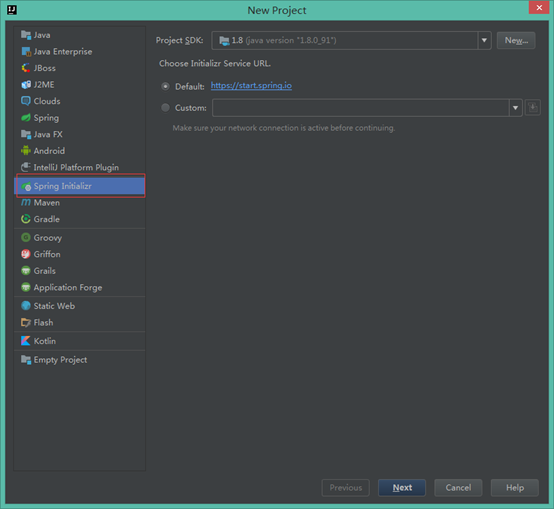
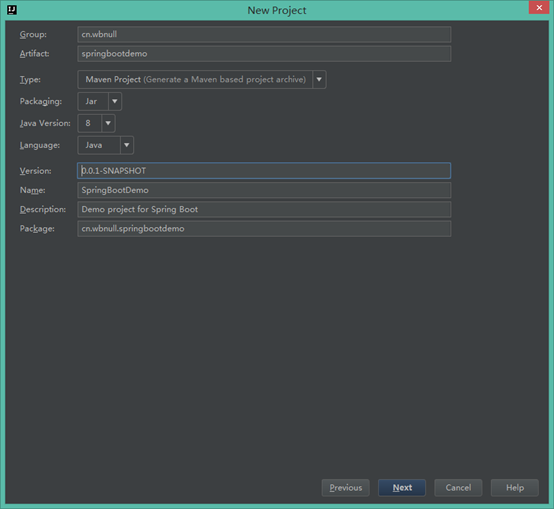
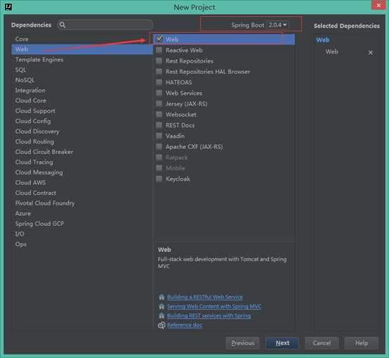
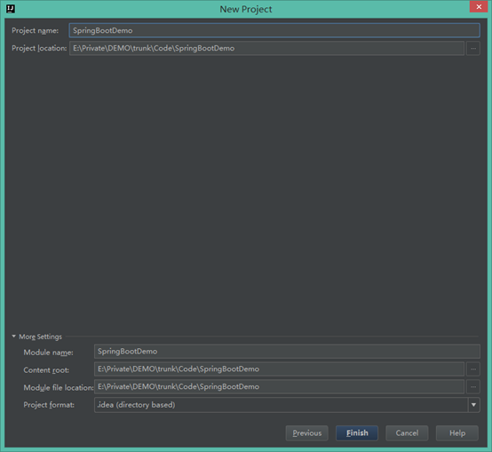
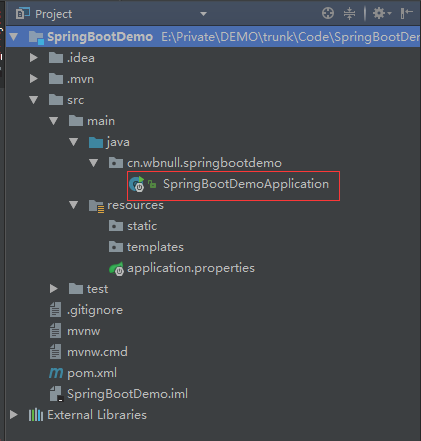
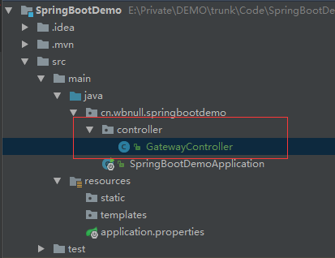
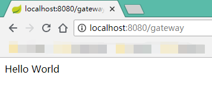
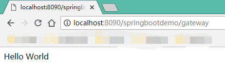

相信使用过Spring MVC框架的小伙伴，都感受过其繁琐的配置。过于细分的配置和与Servlet API的强耦合，使得无论开发还是部署都会费时费力，且容易出现问题。在此基础上，Spring Boot应运而生。

使用Spring Boot可以让我们快速创建一个基于Spring框架的项目，而这个项目，只需要极少的配置。 

# Spring Boot核心功能

**Spring Boot主要有以下核心功能：**

* **1、独立运行的Spring项目**

Spring Boot可以以jar包的形式独立运行，使用：java -jar xxx.jar 就可成功运行Spring Boot项目。

* **2、内嵌Servlet容器**

Spring Boot内嵌Tomcat容器，无需使用war包的方式部署项目，可以通过执行项目的main函数，让项目快速运行。

* **3、提供starter简化Manen配置**

Spring Boot提供了一系列的starter pom用来简化我们的Maven依赖

* **4、自动配置Spring**

Spring Boot会根据我们项目中的jar包依赖，对项目进行自动配置。当然，这只是Spring考虑到的大多数使用场景，在一些特殊情况，还需要我们进行手动配置。

* **5、准生产的应用监控**

Spring Boot提供了基于http、ssh、telnet对运行时的项目进行监控。

* **6、绝对没有代码生成并且对XML也没有配置要求**

Spring Boot实现了自动配置，降低了项目搭建复杂度，包含一整套快速开发包。


如果这里没有搞明白上述核心功能描述的意思，不妨先往下看，等看完整篇文章再回来思索核心功能。


# 第一个Spring Boot程序

以IntelliJ IDEA为例。**Create New Project**，选择**Spring Initializr**，Next。



**填写项目信息**



**选择项目使用到的技术**，这里Spring Boot版本建议选择最新的稳定版，然后下面找到**Web**勾选上即可。



最后一步，填写**项目名和路径**，Finish。



第一次创建Spring Boot项目时，系统会下载一些需要的依赖等，耗时较长，下载成功后等以后再新建项目时会很快创建好。

# 项目结构解析

项目创建成功之后，我们先来看下项目结构。

首先在项目创建完成之后，会自动创建一个类，命名规则是**ProjectName+Application**，比如我们这个项目的SpringBootDemoApplication，这就是**Spring Boot项目的入口类**。我们打开类之后会发现，类中有个**@SpringBootApplication**注解，这是整个Spring Boot的核心注解，作用是**开启Spring Boot的自动配置**。类中还有一个**main方法**，这是**标准的Java应用程序的入口方法**。



我们新建一个类，类结构如图所示。注意，在Spring Boot项目中，只有**入口类（即SpringBootDemoApplication）所在的包及其子包中的类，才会被自动配置**。



新建的类加上**@RestController**注解，使之成为一个Controller，然后在其内提供地址转换方法。

~~~java
@RestController
public class GatewayController {
    @RequestMapping(value = "/gateway")
    public String gateway() {
        return "Hello World";
    }
}
~~~

启动项目


启动成功后就可在浏览器中直接访问。



至此，一个简单的Spring Boot项目就创建成功，并且能够成功访问。

# 项目分析

下面，我们来仔细分析下项目。

* **1、入口类SpringBootDemoApplication.java**

回到入口类SpringBootDemoApplication，刚才说了，项目创建完成之后，会自动创建一个命名规则是ProjectName+Application的类，类中有个**@SpringBootApplication注解**和一个**main方法**，**main方法是一个标准的Java应用程序的入口方法**，而**@SpringBootApplication注解作用是开启Spring Boot的自动配置**。我们进入到@SpringBootApplication注解的源码，可以看到他是一个组合注解，组合了@SpringBootConfiguration、@EnableAutoConfiguration、@ComponentScan等。

**@SpringBootConfiguration**注解就是@Configuration注解，表示该类是一个配置类；

**@ EnableAutoConfiguration**注解作用是让Spring Boot根据jar包依赖为当前项目进行自动配置。比如，如果spring-boot-starter-web已经添加了Tomcat和Spring MVC，这个注解会自动假设正在开发一个Web应用程序并添加相应的Spring设置；

**@ComponentScan**注解的作用是告诉Spring自动扫描并且装入bean容器。


刚才我们就提醒过，**使用@SpringBootApplication注解进行自动配置，系统会去入口类的同级包以及子级包中去扫描实体类**。

```java
@Target({ElementType.TYPE})
@Retention(RetentionPolicy.RUNTIME)
@Documented
@Inherited
@SpringBootConfiguration
@EnableAutoConfiguration
@ComponentScan(
    excludeFilters = {@Filter(
    type = FilterType.CUSTOM,
    classes = {TypeExcludeFilter.class}
), @Filter(
    type = FilterType.CUSTOM,
    classes = {AutoConfigurationExcludeFilter.class}
)}
)
public @interface SpringBootApplication {

}
```

* **2、配置文件application.properties**

Spring Boot使用一个全局的配置文件**application.properties**或者**application.yml**，放在**src/main/resources**目录下。Spring Boot不仅支持常见的properties类型的配置文件，也支持yaml语言的配置文件。


**修改Tomcat默认端口号和默认访问路径**

Tomcat默认端口号是8080，默认访问路径是http://localhost:8080，这里我们将端口号改为8090，访问路径改为http://localhost:8090/springbootdemo。

在application.properties文件中添加如下代码：

```properties
server.port=8090
server.servlet.context-path=/springbootdemo
```

重启项目，浏览器访问




GitHub：https://github.com/dkbnull/SpringBootDemo

CSDN：https://blog.csdn.net/dkbnull/article/details/81806983

微信：https://mp.weixin.qq.com/s/T5tJb6_mzCQvfnMElR-txQ

微博：https://weibo.com/ttarticle/p/show?id=2309404274446708936566

知乎：https://zhuanlan.zhihu.com/p/63766884