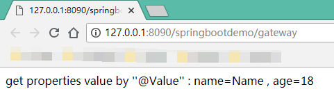
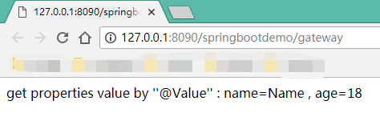
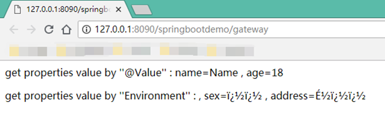
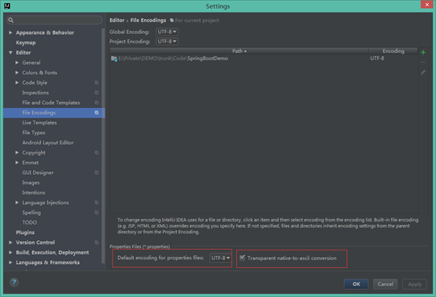
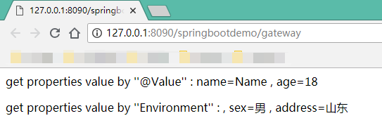
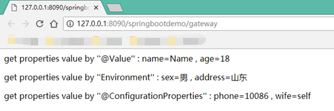

**Spring Boot最常用的3种读取properties配置文件中数据的方法：**

# 使用@Value注解读取

读取properties配置文件时，默认读取的是**application.properties**。

application.properties：

~~~properties
demo.name=Name
demo.age=18
~~~

Java代码：

~~~java
import org.springframework.beans.factory.annotation.Value;
import org.springframework.web.bind.annotation.RequestMapping;
import org.springframework.web.bind.annotation.RestController;

@RestController
public class GatewayController {

    @Value("${demo.name}")
    private String name;

    @Value("${demo.age}")
    private String age;

    @RequestMapping(value = "/gateway")
    public String gateway() {
        return "get properties value by ''@Value'' :" +
                //1、使用@Value注解读取
                " name=" + name +
                " , age=" + age;
    }
}
~~~

运行结果如下：

这里，如果要把

~~~java
	@Value("${demo.name}")
    private String name;

    @Value("${demo.age}")
    private String age;
~~~

部分放到一个单独的类A中进行读取，然后在类B中调用，则要把类A增加@Component注解，并在类B中使用@Autowired自动装配类A，代码如下。

类A：

~~~java
import org.springframework.beans.factory.annotation.Value;
import org.springframework.stereotype.Component;

@Component
public class ConfigBeanValue {

    @Value("${demo.name}")
    public String name;

    @Value("${demo.age}")
    public String age;
}
~~~

类B：

~~~java
import cn.wbnull.springbootdemo.config.ConfigBeanValue;
import org.springframework.beans.factory.annotation.Autowired;
import org.springframework.web.bind.annotation.RequestMapping;
import org.springframework.web.bind.annotation.RestController;

@RestController
public class GatewayController {

    @Autowired
    private ConfigBeanValue configBeanValue;

    @RequestMapping(value = "/gateway")
    public String gateway() {
        return "get properties value by ''@Value'' :" +
                //1、使用@Value注解读取
                " name=" + configBeanValue.name +
                " , age=" + configBeanValue.age;
    }
}
~~~

运行结果如下：

注意：如果@Value\${}所包含的键名在application.properties配置文件中不存在的话，会抛出异常：

~~~
org.springframework.beans.factory.BeanCreationException: Error creating bean with name 'configBeanValue': Injection of autowired dependencies failed; nested exception is java.lang.IllegalArgumentException: Could not resolve placeholder 'demo.name' in value "${demo.name}"
~~~

# 使用Environment读取

application.properties：

~~~properties
demo.sex=男
demo.address=山东
~~~

Java代码：

~~~java
import cn.wbnull.springbootdemo.config.ConfigBeanValue;
import org.springframework.beans.factory.annotation.Autowired;
import org.springframework.core.env.Environment;
import org.springframework.web.bind.annotation.RequestMapping;
import org.springframework.web.bind.annotation.RestController;

@RestController
public class GatewayController {

    @Autowired
    private ConfigBeanValue configBeanValue;

    @Autowired
    private Environment environment;

    @RequestMapping(value = "/gateway")
    public String gateway() {
        return "get properties value by ''@Value'' :" +
                //1、使用@Value注解读取
                " name=" + configBeanValue.name +
                " , age=" + configBeanValue.age +
                "
get properties value by ''Environment'' :" +
                //2、使用Environment读取
                " , sex=" + environment.getProperty("demo.sex") +
                " , address=" + environment.getProperty("demo.address");
    }
}
~~~

运行，发现中文乱码：

这里，我们在application.properties做如下配置：

~~~properties
server.tomcat.uri-encoding=UTF-8
spring.http.encoding.charset=UTF-8
spring.http.encoding.enabled=true
spring.http.encoding.force=true
spring.messages.encoding=UTF-8
~~~

然后修改IntelliJ IDEA，File \--\> Settings \--\> Editor \--\> File Encodings ，将最下方Default encoding for properties files设置为UTF-8，并勾选Transparent native-to-ascii conversion。

重新运行结果如下：

# 使用@ConfigurationProperties注解读取

在实际项目中，当项目需要注入的变量值很多时，上述所述的两种方法工作量会变得比较大，这时候我们通常使用基于类型安全的配置方式，将properties属性和一个Bean关联在一起，即使用注解\@ConfigurationProperties读取配置文件数据。

在src\\main\\resources下新建config.properties配置文件：

~~~properties
demo.phone=10086
demo.wife=self
~~~

创建ConfigBeanProp并注入config.properties中的值：

~~~java
import org.springframework.boot.context.properties.ConfigurationProperties;
import org.springframework.context.annotation.PropertySource;
import org.springframework.stereotype.Component;

@Component
@ConfigurationProperties(prefix = "demo")
@PropertySource(value = "config.properties")
public class ConfigBeanProp {

    private String phone;

    private String wife;

    public String getPhone() {
        return phone;
    }

    public void setPhone(String phone) {
        this.phone = phone;
    }

    public String getWife() {
        return wife;
    }

    public void setWife(String wife) {
        this.wife = wife;
    }
}
~~~

* @Component 表示将该类标识为Bean

* @ConfigurationProperties(prefix = "demo")用于绑定属性，其中prefix表示所绑定的属性的前缀。

* @PropertySource(value = "config.properties")表示配置文件路径。

使用时，先使用\@Autowired自动装载ConfigBeanProp，然后再进行取值，示例如下：

~~~java
import cn.wbnull.springbootdemo.config.ConfigBeanProp;
import cn.wbnull.springbootdemo.config.ConfigBeanValue;
import org.springframework.beans.factory.annotation.Autowired;
import org.springframework.core.env.Environment;
import org.springframework.web.bind.annotation.RequestMapping;
import org.springframework.web.bind.annotation.RestController;

@RestController
public class GatewayController {

    @Autowired
    private ConfigBeanValue configBeanValue;

    @Autowired
    private Environment environment;

    @Autowired
    private ConfigBeanProp configBeanProp;

    @RequestMapping(value = "/gateway")
    public String gateway() {
        return "get properties value by ''@Value'' :" +
                //1、使用@Value注解读取
                " name=" + configBeanValue.name +
                " , age=" + configBeanValue.age +
                "
get properties value by ''Environment'' :" +
                //2、使用Environment读取
                " sex=" + environment.getProperty("demo.sex") +
                " , address=" + environment.getProperty("demo.address") +
                "
get properties value by ''@ConfigurationProperties'' :" +
                //3、使用@ConfigurationProperties注解读取
                " phone=" + configBeanProp.getPhone() +
                " , wife=" + configBeanProp.getWife();
    }
}
~~~

运行结果如下：

 

---

GitHub：[https://github.com/dkbnull/SpringBootDemo](https://github.com/dkbnull/SpringBootDemo)

CSDN：[https://blog.csdn.net/dkbnull/article/details/81953190](https://blog.csdn.net/dkbnull/article/details/81953190)

微信：[https://mp.weixin.qq.com/s/swtkNq6CLMsP4uc4PgaVHg](https://mp.weixin.qq.com/s/swtkNq6CLMsP4uc4PgaVHg)

微博：[https://weibo.com/ttarticle/p/show?id=2309404275977214638710](https://weibo.com/ttarticle/p/show?id=2309404275977214638710)

知乎：[https://zhuanlan.zhihu.com/p/73059356](https://zhuanlan.zhihu.com/p/73059356)