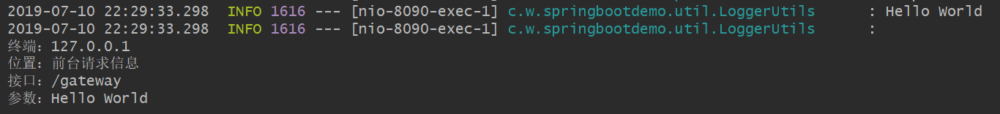

# 0. 开发环境

- IDE：IntelliJ IDEA 2019.1.2
- JDK：1.8.0_211
- Spring Boot：2.1.1.RELEASE

# 1. Logback简介

Logback是由log4j创始人设计的又一个开源日志组件。logback当前分成三个模块：logback-core,logback- classic和logback-access。logback-core是其它两个模块的基础模块。logback-classic是log4j的一个 改良版本。此外logback-classic完整实现SLF4J API使你可以很方便地更换成其它日志系统如log4j或JDK14 Logging。logback-access访问模块与Servlet容器集成提供通过Http来访问日志的功能。 

# 2. Spring Boot集成Logback

Spring Boot内部集成了LogBack日志依赖，并且Spring Boot默认使用LogBack记录日志信息，默认根据base.xml配置内容来输出到控制台和文件之中。

## 2.1 新建logback-spring.xml

**resources目录下新建logback-spring.xml**

这里也可以新建logback.xml，但是官方推荐使用logback-spring.xml，因为带spring后缀的xml文件可以使用<springProfile>标签。

~~~xml
<?xml version="1.0" encoding="UTF-8"?>
<configuration debug="false">
    <!--日志文件的存储位置-->
    <property name="LOG_HOME" value="./logs"/>

    <!--控制台输出-->
    <appender name="CONSOLE" class="ch.qos.logback.core.ConsoleAppender">
        <encoder class="ch.qos.logback.classic.encoder.PatternLayoutEncoder">
            <!--格式化日志输出：%d表示日期；%thread表示线程名；%-5level表示日志级别，且从左显示5个字符宽度；
            %logger表示日志输出位置；%msg表示日志内容；%n表示换行符-->
            <pattern>%d{yyyy-MM-dd HH:mm:ss.SSS} [%thread] %-5level %logger{50} - %msg %n</pattern>
            <charset>UTF-8</charset>
        </encoder>
    </appender>

    <!--日志文件输出-->
    <appender name="LOG_INFO" class="ch.qos.logback.core.rolling.RollingFileAppender">
        <rollingPolicy class="ch.qos.logback.core.rolling.TimeBasedRollingPolicy">
            <!--日志文件输出的文件名-->
            <FileNamePattern>${LOG_HOME}/log_%d{yyyy-MM-dd}.log</FileNamePattern>
            <!--日志保留天数-->
            <MaxHistory>180</MaxHistory>
        </rollingPolicy>
        <encoder class="ch.qos.logback.classic.encoder.PatternLayoutEncoder">
            <!--格式化日志输出：%d表示日期；%thread表示线程名；%-5level表示日志级别，且从左显示5个字符宽度；
            %logger表示日志输出位置；%msg表示日志内容；%n表示换行符-->
            <pattern>%d{yyyy-MM-dd HH:mm:ss.SSS} [%thread] %-5level %logger{50} - %msg %n</pattern>
        </encoder>
        <triggeringPolicy class="ch.qos.logback.core.rolling.SizeBasedTriggeringPolicy">
            <!--日志文件最大大小-->
            <MaxFileSize>10MB</MaxFileSize>
        </triggeringPolicy>
    </appender>

    <!--日志输出级别-->
    <root level="INFO">
        <appender-ref ref="CONSOLE"/>
        <appender-ref ref="LOG_INFO"/>
    </root>
</configuration>
~~~

## 2.2 新建控制器类

~~~java
package cn.wbnull.springbootdemo.controller;

import cn.wbnull.springbootdemo.util.LoggerUtils;
import org.springframework.web.bind.annotation.RequestMapping;
import org.springframework.web.bind.annotation.RestController;

@RestController
public class GatewayController {

    @RequestMapping(value = "/gateway")
    public String gateway() {
        LoggerUtils.info("Hello World");
        LoggerUtils.info("127.0.0.1", "前台请求信息", "/gateway", "Hello World");
        return "Hello World";
    }
}
~~~

## 2.3 测试

运行Spring Boot程序，控制台打印日志如下

~~~
2019-07-10 22:24:54.277 [http-nio-8090-exec-1] INFO  cn.wbnull.springbootdemo.util.LoggerUtils - Hello World 
2019-07-10 22:24:54.277 [http-nio-8090-exec-1] INFO  cn.wbnull.springbootdemo.util.LoggerUtils - 
终端：127.0.0.1
位置：前台请求信息
接口：/gateway
参数：Hello World
~~~

# 3. 彩色日志

## 3.1 修改logback-spring.xml

~~~xml
<?xml version="1.0" encoding="UTF-8"?>
<configuration debug="false">
    <!--日志文件的存储位置-->
    <property name="LOG_HOME" value="./logs"/>

    <!--彩色日志依赖的渲染类-->
    <conversionRule conversionWord="clr" converterClass="org.springframework.boot.logging.logback.ColorConverter"/>
    <conversionRule conversionWord="wex"
                    converterClass="org.springframework.boot.logging.logback.WhitespaceThrowableProxyConverter"/>
    <conversionRule conversionWord="wEx"
                    converterClass="org.springframework.boot.logging.logback.ExtendedWhitespaceThrowableProxyConverter"/>
    <!--彩色日志格式-->
    <property name="CONSOLE_LOG_PATTERN"
              value="${CONSOLE_LOG_PATTERN:-%clr(%d{yyyy-MM-dd HH:mm:ss.SSS}){faint} %clr(${LOG_LEVEL_PATTERN:-%5p}) %clr(${PID:- }){magenta} %clr(---){faint} %clr([%15.15t]){faint} %clr(%-40.40logger{39}){cyan} %clr(:){faint} %m%n${LOG_EXCEPTION_CONVERSION_WORD:-%wEx}}"/>

    <!--控制台输出-->
    <appender name="CONSOLE" class="ch.qos.logback.core.ConsoleAppender">
        <encoder class="ch.qos.logback.classic.encoder.PatternLayoutEncoder">
            <!--格式化日志输出：%d表示日期；%thread表示线程名；%-5level表示日志级别，且从左显示5个字符宽度；
            %logger表示日志输出位置；%msg表示日志内容；%n表示换行符-->
            <!--<pattern>%d{yyyy-MM-dd HH:mm:ss.SSS} [%thread] %-5level %logger{50} - %msg %n</pattern>-->
            <!--彩色日志-->
            <Pattern>${CONSOLE_LOG_PATTERN}</Pattern>
            <charset>UTF-8</charset>
        </encoder>
    </appender>

    <!--日志文件输出-->
    <appender name="LOG_INFO" class="ch.qos.logback.core.rolling.RollingFileAppender">
        <rollingPolicy class="ch.qos.logback.core.rolling.TimeBasedRollingPolicy">
            <!--日志文件输出的文件名-->
            <FileNamePattern>${LOG_HOME}/log_%d{yyyy-MM-dd}.log</FileNamePattern>
            <!--日志保留天数-->
            <MaxHistory>180</MaxHistory>
        </rollingPolicy>
        <encoder class="ch.qos.logback.classic.encoder.PatternLayoutEncoder">
            <!--格式化日志输出：%d表示日期；%thread表示线程名；%-5level表示日志级别，且从左显示5个字符宽度；
            %logger表示日志输出位置；%msg表示日志内容；%n表示换行符-->
            <pattern>%d{yyyy-MM-dd HH:mm:ss.SSS} [%thread] %-5level %logger{50} - %msg %n</pattern>
        </encoder>
        <triggeringPolicy class="ch.qos.logback.core.rolling.SizeBasedTriggeringPolicy">
            <!--日志文件最大大小-->
            <MaxFileSize>10MB</MaxFileSize>
        </triggeringPolicy>
    </appender>

    <!--日志输出级别-->
    <root level="INFO">
        <appender-ref ref="CONSOLE"/>
        <appender-ref ref="LOG_INFO"/>
    </root>
</configuration>
~~~

## 3.2 测试

 

---

GitHub：[https://github.com/dkbnull/SpringBootDemo](https://github.com/dkbnull/SpringBootDemo)

CSDN：[https://blog.csdn.net/dkbnull/article/details/95390533](https://blog.csdn.net/dkbnull/article/details/95390533)

微信：[https://mp.weixin.qq.com/s/YDDsMcvmQURn4D9J9kNfQQ](https://mp.weixin.qq.com/s/YDDsMcvmQURn4D9J9kNfQQ)

微博：[https://weibo.com/ttarticle/p/show?id=2309404453119672057989](https://weibo.com/ttarticle/p/show?id=2309404453119672057989)

知乎：[https://zhuanlan.zhihu.com/p/99188924](https://zhuanlan.zhihu.com/p/99188924)

