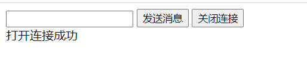
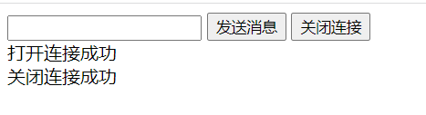
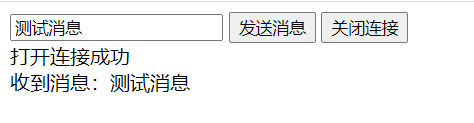

# 0. 开发环境

- JDK：1.8
- Spring Boot：2.1.1.RELEASE

# 1. 引入依赖

```xml
        <dependency>
            <groupId>org.springframework.boot</groupId>
            <artifactId>spring-boot-starter-websocket</artifactId>
        </dependency>
```

# 2. 新建WebSocket配置类

```java
import org.springframework.context.annotation.Bean;
import org.springframework.context.annotation.Configuration;
import org.springframework.web.socket.server.standard.ServerEndpointExporter;

@Configuration
public class WebSocketConfig {

    /**
     * ServerEndpointExporter注入
     * 该Bean会自动注册使用@ServerEndpoint注解申明的WebSocket endpoint
     *
     * @return
     */
    @Bean
    public ServerEndpointExporter serverEndpointExporter() {
        return new ServerEndpointExporter();
    }
}
```

# 3. 新建WebSocket服务类

```java
package cn.wbnull.springbootdemo.service;

import org.slf4j.Logger;
import org.slf4j.LoggerFactory;
import org.springframework.stereotype.Component;

import javax.websocket.*;
import javax.websocket.server.PathParam;
import javax.websocket.server.ServerEndpoint;
import java.io.IOException;
import java.util.Map;
import java.util.concurrent.ConcurrentHashMap;

@Component
@ServerEndpoint("/websocket/{terminalId}")
public class WebSocketService {

    private final Logger logger = LoggerFactory.getLogger(WebSocketService.class);

    /**
     * 保存连接信息
     */
    private static final Map<String, Session> CLIENTS = new ConcurrentHashMap<>();

    @OnOpen
    public void onOpen(@PathParam("terminalId") String terminalId, Session session) throws Exception {
        logger.info(session.getRequestURI().getPath() + "，打开连接开始：" + session.getId());

        //当前连接已存在，关闭
        if (CLIENTS.containsKey(terminalId)) {
            onClose(CLIENTS.get(terminalId));
        }

        CLIENTS.put(terminalId, session);

        logger.info(session.getRequestURI().getPath() + "，打开连接完成：" + session.getId());
    }

    @OnClose
    public void onClose(@PathParam("terminalId") String terminalId, Session session) throws Exception {
        logger.info(session.getRequestURI().getPath() + "，关闭连接开始：" + session.getId());

        CLIENTS.remove(terminalId);

        logger.info(session.getRequestURI().getPath() + "，关闭连接完成：" + session.getId());
    }

    @OnMessage
    public void onMessage(String message, Session session) {
        logger.info("前台发送消息：" + message);
    }

    @OnError
    public void onError(Session session, Throwable error) {
        logger.error(error.toString());
    }

    public void onClose(Session session) {
        //判断当前连接是否在线
//        if (!session.isOpen()) {
//            return;
//        }

        try {
            session.close();
        } catch (IOException e) {
            logger.error("金斗云关闭连接异常：" + e);
        }
    }

    public void sendMessage(String message, Session session) {
        try {
            session.getAsyncRemote().sendText(message);

            logger.info("推送成功：" + message);
        } catch (Exception e) {
            logger.error("推送异常：" + e);
        }
    }

    public boolean sendMessage(String terminalId, String message) {
        try {
            Session session = CLIENTS.get(terminalId);
            session.getAsyncRemote().sendText(message);

            logger.info("推送成功：" + message);
            return true;
        } catch (Exception e) {
            logger.error("推送异常：" + e);
            return false;
        }
    }
}
```

# 4. 新建Web端连接页面

```html
<!DOCTYPE html>
<html lang="en">
<head>
    <meta charset="UTF-8">
    <title>WebSocket Test</title>
</head>
<body>

<label for="text"></label><input id="text" type="text"/>
<button onclick="sendMessage()">发送消息</button>
<button onclick="closeWebSocket()">关闭连接</button>
<div id="message"></div>
</body>

<script type="text/javascript">
    let websocket = null;

    //判断当前浏览器是否支持WebSocket
    if ('WebSocket' in window) {
        websocket = new WebSocket("ws://localhost:8090/websocket/123456");
    } else {
        alert('Not support websocket');
    }

    //连接发生错误的回调方法
    websocket.onerror = function () {
        showMessage("打开连接失败");
    };

    //连接成功建立的回调方法
    websocket.onopen = function (event) {
        showMessage("打开连接成功");
    }

    //接收到消息的回调方法
    websocket.onmessage = function (event) {
        showMessage(event.data);
    }

    //连接关闭的回调方法
    websocket.onclose = function () {
        showMessage("关闭连接成功");
    }

    //监听窗口关闭事件，当窗口关闭时，主动关闭WebSocket连接
    window.onbeforeunload = function () {
        websocket.close();
    }

    function showMessage(message) {
        document.getElementById('message').innerHTML += message + '<br/>';
    }

    function closeWebSocket() {
        websocket.close();
    }

    //发送消息
    function sendMessage() {
        const message = document.getElementById('text').value;
        websocket.send(message);
    }
</script>
</html>
```

# 5. 设置后端消息推送

为便于测试，直接修改WebSocketService，当收到前台消息时，直接给前台发送消息

```
    @OnMessage
    public void onMessage(String message, Session session) {
        logger.info("前台发送消息：" + message);

        sendMessage("收到消息：" + message, session);
    }
```

# 6. 测试

浏览器访问http://127.0.0.1:8090/，页面显示如下：



后台日志如下：

~~~
2022-07-02 21:03:22.753  INFO 9168 --- [nio-8090-exec-2] c.w.s.service.WebSocketService           : /websocket/123456，打开连接开始：0
2022-07-02 21:03:22.753  INFO 9168 --- [nio-8090-exec-2] c.w.s.service.WebSocketService           : /websocket/123456，打开连接完成：0
~~~

当我们浏览器打开第二个页面，第一个页面会显示断开连接



后台日志如下：

~~~
2022-07-02 21:04:01.936  INFO 9168 --- [nio-8090-exec-4] c.w.s.service.WebSocketService           : /websocket/123456，打开连接开始：1
2022-07-02 21:04:01.938  INFO 9168 --- [nio-8090-exec-4] c.w.s.service.WebSocketService           : /websocket/123456，关闭连接开始：0
2022-07-02 21:04:01.938  INFO 9168 --- [nio-8090-exec-4] c.w.s.service.WebSocketService           : /websocket/123456，关闭连接完成：0
2022-07-02 21:04:01.938  INFO 9168 --- [nio-8090-exec-4] c.w.s.service.WebSocketService           : /websocket/123456，打开连接完成：1
~~~

前台页面录入消息并发送，后台可正常收到消息

~~~
2022-07-02 21:08:21.860  INFO 1772 --- [nio-8090-exec-3] c.w.s.service.WebSocketService           : 前台发送消息：测试消息
2022-07-02 21:08:21.863  INFO 1772 --- [nio-8090-exec-3] c.w.s.service.WebSocketService           : 推送成功：收到消息：测试消息
~~~

前台页面显示正常



点击关闭连接，可以正常关闭

# 7. 服务保活

对于实时消息推送相关服务，都存在保活问题。这里我们采用心跳保活。 修改WebSocketService类

```java
import org.slf4j.Logger;
import org.slf4j.LoggerFactory;
import org.springframework.stereotype.Component;

import javax.websocket.*;
import javax.websocket.server.PathParam;
import javax.websocket.server.ServerEndpoint;
import java.io.IOException;
import java.util.HashMap;
import java.util.Map;
import java.util.concurrent.ConcurrentHashMap;
import java.util.concurrent.atomic.AtomicInteger;

@Component
@ServerEndpoint("/websocket/{terminalId}")
public class WebSocketService {

    private final Logger logger = LoggerFactory.getLogger(WebSocketService.class);

    /**
     * 保存连接信息
     */
    private static final Map<String, Session> CLIENTS = new ConcurrentHashMap<>();
    private static final Map<String, AtomicInteger> TERMINAL_IDS = new HashMap<>();

    @OnOpen
    public void onOpen(@PathParam("terminalId") String terminalId, Session session) throws Exception {
        logger.info(session.getRequestURI().getPath() + "，打开连接开始：" + session.getId());

        //当前连接已存在，关闭
        if (CLIENTS.containsKey(terminalId)) {
            onClose(CLIENTS.get(terminalId));
        }

        TERMINAL_IDS.put(terminalId, new AtomicInteger(0));
        CLIENTS.put(terminalId, session);

        logger.info(session.getRequestURI().getPath() + "，打开连接完成：" + session.getId());
    }

    @OnClose
    public void onClose(@PathParam("terminalId") String terminalId, Session session) throws Exception {
        logger.info(session.getRequestURI().getPath() + "，关闭连接开始：" + session.getId());

        CLIENTS.remove(terminalId);
        TERMINAL_IDS.remove(terminalId);

        logger.info(session.getRequestURI().getPath() + "，关闭连接完成：" + session.getId());
    }

    @OnMessage
    public void onMessage(String message, Session session) {
        logger.info("前台发送消息：" + message);

        if ("心跳".equals(message)) {
            //重置当前终端心跳次数
            TERMINAL_IDS.get(message).set(0);
            return;
        }

        sendMessage("收到消息：" + message, session);
    }

    @OnError
    public void onError(Session session, Throwable error) {
        logger.error(error.toString());
    }

    public void onClose(Session session) {
        //判断当前连接是否在线
//        if (!session.isOpen()) {
//            return;
//        }

        try {
            session.close();
        } catch (IOException e) {
            logger.error("金斗云关闭连接异常：" + e);
        }
    }

    public void heartbeat() {
        //检查所有终端心跳次数
        for (String key : TERMINAL_IDS.keySet()) {
            //心跳3次及以上的主动断开
            if ((TERMINAL_IDS.get(key).intValue() >= 3)) {
                logger.info("心跳超时，关闭连接：" + key);
                onClose(CLIENTS.get(key));
            }
        }

        for (String key : CLIENTS.keySet()) {
            //记录当前终端心跳次数
            TERMINAL_IDS.get(key).incrementAndGet();
            sendMessage("心跳", CLIENTS.get(key));
        }
    }

    public void sendMessage(String message, Session session) {
        try {
            session.getAsyncRemote().sendText(message);

            logger.info("推送成功：" + message);
        } catch (Exception e) {
            logger.error("推送异常：" + e);
        }
    }

    public boolean sendMessage(String terminalId, String message) {
        try {
            Session session = CLIENTS.get(terminalId);
            session.getAsyncRemote().sendText(message);

            logger.info("推送成功：" + message);
            return true;
        } catch (Exception e) {
            logger.error("推送异常：" + e);
            return false;
        }
    }
}
```

# 8. 新增定时任务

新增定时任务，定时给连接到WebSocket的终端发送消息，超过指定次数未回应的终端视为离线，主动关闭连接。

```java
import cn.wbnull.springbootdemo.service.WebSocketService;
import org.springframework.beans.factory.annotation.Autowired;
import org.springframework.scheduling.annotation.EnableScheduling;
import org.springframework.scheduling.annotation.Scheduled;
import org.springframework.stereotype.Component;

@EnableScheduling
@Component
public class WebSocketScheduled {

    @Autowired
    private WebSocketService webSocketService;

    @Scheduled(cron = "0/15 * * * * ?")
    public void heartbeat() {
        webSocketService.heartbeat();
    }
}
```

同样的，前台也需要定时心跳WebSocket，这里不做赘述。

# 9. Bean注入

WebSocket服务类中，使用@Autowired直接注入Service或普通Bean时，会报空指针错误。这是因为Spring管理对象时使用单例模式，但WebSocket服务为多对象。

Spring Boot项目在启动初始化时，会初始化非用户连接的WebSocket服务，为其注入Service，此时使用@Autowired注入的Service不为null，即被成功注入。 但，Spring默认管理的是单例，所以只会注入一次Service。 当新用户连接时，系统又会创建一个新的WebSocket对象，Spring就不会给第二个 WebSocket对象注入Service了，所以导致只要是用户连接创建的WebSocket 对象，都不能再注入了。

```java
import org.slf4j.Logger;
import org.slf4j.LoggerFactory;
import org.springframework.beans.factory.annotation.Autowired;
import org.springframework.stereotype.Component;

import javax.websocket.*;
import javax.websocket.server.PathParam;
import javax.websocket.server.ServerEndpoint;
import java.io.IOException;
import java.util.HashMap;
import java.util.Map;
import java.util.concurrent.ConcurrentHashMap;
import java.util.concurrent.atomic.AtomicInteger;

@Component
@ServerEndpoint("/websocket/{terminalId}")
public class WebSocketService {

	//code
    
    /**
     * 需要注入的Service声明为静态，让其属于类
     */
    private static TerminalService terminalService;

    /**
     * 注入的时候，给类的Service注入
     */
    @Autowired
    public void setMchDeviceInfoService(TerminalService terminalService) {
        WebSocketService.terminalService = terminalService;
    }

    @OnOpen
    public void onOpen(@PathParam("terminalId") String terminalId, Session session) throws Exception {
		//code

        terminalService.terminal();
    }

    //code
}
```

测试日志打印如下

~~~
2022-07-02 21:26:08.166  INFO 9924 --- [nio-8090-exec-2] c.w.s.service.WebSocketService           : /websocket/123456，打开连接开始：0
2022-07-02 21:26:08.166  INFO 9924 --- [nio-8090-exec-2] c.w.s.service.WebSocketService           : /websocket/123456，打开连接完成：0
2022-07-02 21:26:08.166  INFO 9924 --- [nio-8090-exec-2] c.w.s.service.TerminalService            : 这是一条测试日志
~~~

<br>

---

GitHub：[https://github.com/dkbnull/SpringBootDemo](https://github.com/dkbnull/SpringBootDemo)

CSDN：[https://blog.csdn.net/dkbnull/article/details/125577993](https://blog.csdn.net/dkbnull/article/details/125577993)

微信：[https://mp.weixin.qq.com/s/Je9QSWstU5bxDakFCILFZg](https://mp.weixin.qq.com/s/Je9QSWstU5bxDakFCILFZg)

微博：[https://weibo.com/ttarticle/p/show?id=2309404786910215406111](https://weibo.com/ttarticle/p/show?id=2309404786910215406111)

知乎：[https://zhuanlan.zhihu.com/p/536839230](https://zhuanlan.zhihu.com/p/536839230)

